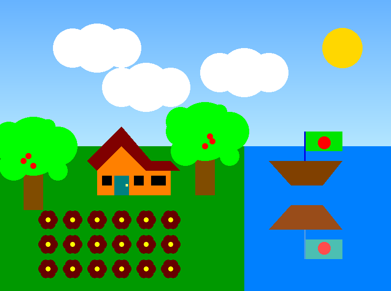

# Village-Scenario-OpenGL-project

 <!-- You can replace this with an actual preview image if you have one -->

This project is part of our CSE423 Graphics Design course. The aim of this project is to create an interactive village scenario using OpenGL, where various elements of the scene respond to user input.

## Team Members

- Abrar Mustakim Taki
- Ananna Acharjee
- Ashiqur Rahman Fahim
- Fahim Ahamed

## Project Details

In this project, we have developed a village scenario using OpenGL. The scene includes various elements such as houses, trees, clouds, birds, sun, and moon. The scene can be interactively modified based on user input:

- Pressing 'L': The scene transitions to day mode. The sun shines, birds fly, and a boat moves along the river.
- Pressing 'D': The scene transitions to night mode, creating a darker atmosphere.
- Pressing 'R': Rain is simulated, creating a rainy scenario with appropriate visual effects.

The project aims to showcase our understanding of computer graphics concepts and our ability to create interactive scenes using OpenGL. It demonstrates our teamwork and skills in designing visually appealing scenarios.

## How to Run

1. Clone this repository to your local machine.
2. Make sure you have OpenGL installed.
3. Compile the project using [compile_command_here].
4. Run the executable.
5. Interact with the scene using keyboard input ('L', 'D', 'R') to experience different scenarios.

## Project Structure

- `src/` : Contains the source code for the project.
- `assets/` : Contains any additional assets used in the project (textures, models, etc.).
- `compile_command_here` : Replace this with the actual compilation command for your project.
- `project_preview.png` : An image preview of the project (you can replace it with an actual preview image).

## Acknowledgments

We would like to express our gratitude to our instructor and fellow classmates for their support and guidance throughout this project.

